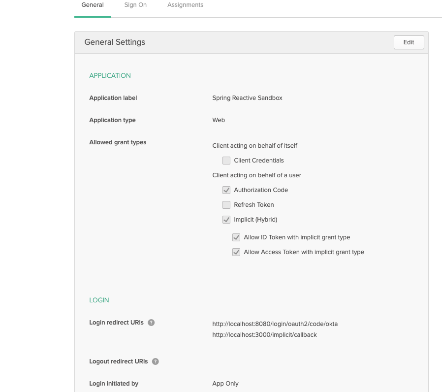

# samo-reactive-sandox
<strong>A Spring reactive sandbox for anything wherever </strong>
#### Technologies demonstrated: 
* Spring Boot 2  
* Spring Webflux  
* spring-boot-starter-data-mongodb-reactive
* Mongodb  
* Reactjs with Typescript  
* Spring 5 Security  
* Okta
### Secrutiy Configuration
* Set up a web application through [Okta account] (https://developer.okta.com/)  
* Allowed Grant Types:  
  ```
  Authorization Code
  Implicit(Hybrid) for both ID and Access Token  
  ```  
* Redirect URi's:  
  ```
  http://localhost:8080/login/oauth2/code/okta	
  http://localhost:3000/implicit/callback  
  ```
* Set following Environment Variable's with Okta security information  
  - THere are many ways to set env variables for a Java application, I use .bash_profile for command line environment, and  https://github.com/ersiner/osx-env-sync to sync .bash_profile env variables with eclipse  
```
export REACT_APP_OKTA_ISSUER_URI=https://dev-548917.okta.com/oauth2/default
export REACT_APP_SPRING_REACTIVE_SANDBOX_CLIENT_ID={client-id)
export REACT_APP_SPRING_REACTIVE_SANDBOX_CLIENT_SECRET={client-secret}
```  

## OKTA web application configuration example:    
  


References: 
* [Spring Docs](https://docs.spring.io/spring-framework/docs/5.0.0.BUILD-SNAPSHOT/spring-framework-reference/html/web-reactive.html)  
* [Blog from Okta](https://developer.okta.com/blog/2018/09/21/reactive-programming-with-spring)     

